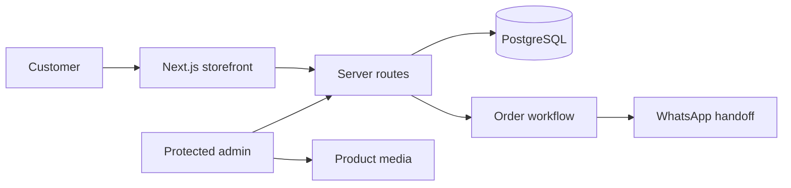

<div align="center">

# Güteli Bakery

**Full-stack bakery ordering experience built with Next.js, TypeScript, PostgreSQL, and Docker.**

Spanish-first, mobile-first storefront for browsing baked goods, building an order request, choosing pickup or delivery, and handing the request to the bakery for human confirmation.


</div>

## What It Demonstrates

Güteli began as a storefront MVP and evolved into a full-stack application with persistent catalog and order workflows, protected administrative routes, product media handling, and a bounded WhatsApp notification integration.

| Area | Implemented |
| --- | --- |
| Storefront | Responsive home, menu, cart, order, confirmation, and contact experiences |
| Commerce UX | GTQ totals, editable quantities, pickup/delivery, date validation, and Spanish order summaries |
| Backend | Next.js server routes, validation, PostgreSQL persistence, and health checks |
| Data layer | Drizzle ORM with versioned SQL migrations |
| Admin | Protected order, product, category, user, and media-management workflows |
| Integration | User-controlled WhatsApp handoff plus an owner-notification provider boundary |
| Quality | Vitest, integration tests, Playwright E2E, linting, formatting, and type checking |

## Product Walkthrough

<table>
  <tr>
    <td width="50%" align="center">
      <a href="artifacts/screenshots/desktop/milestone-3-homepage.png"></a><br>
      <strong>Storefront</strong><br>
      Branded Spanish-first landing experience with a clear ordering journey.
    </td>
    <td width="50%" align="center">
      <a href="artifacts/screenshots/desktop/milestone-3-cart.png"></a><br>
      <strong>Cart & order request</strong><br>
      Editable products, GTQ subtotal, fulfillment choice, and customer details.
    </td>
  </tr>
  <tr>
    <td align="center">
      <a href="artifacts/screenshots/desktop/milestone-3-confirmation.png"></a><br>
      <strong>Order confirmation</strong><br>
      Receipt-style confirmation with order state and requested products.
    </td>
    <td align="center">
      <a href="artifacts/screenshots/mobile/milestone-3-homepage.png"></a><br>
      <strong>Mobile-first UX</strong><br>
      The same customer journey verified on a narrow mobile viewport.
    </td>
  </tr>
</table>

## Architecture at a Glance



The customer-facing flow stays intentionally simple while persistence, administration, media handling, and integrations remain separate backend concerns.

## Engineering Highlights

- **Persistent commerce state:** product catalog and order workflows use PostgreSQL rather than browser-only demo state.
- **Explicit migrations:** schema changes are versioned under `drizzle/`; the application does not silently migrate on request handling.
- **Admin boundary:** separate routes exist for orders, products, categories, users, and media operations.
- **Image handling:** product image storage and validation are implemented behind dedicated server/storage modules.
- **Order safety:** order contracts, request hashing, validation, and status handling are server-side concerns.
- **Testing isolation:** database-backed tests use an isolated test database, while Playwright validates the browser journey.
- **Operational baseline:** Docker Compose and a `/health` route support repeatable local runtime checks.

## Tech Stack

**Frontend:** Next.js 16 · React 19 · TypeScript  
**Backend:** Next.js server routes · Zod · Better Auth  
**Data:** PostgreSQL · Drizzle ORM  
**Testing:** Vitest · Playwright · integration tests  
**Infrastructure:** Docker · Docker Compose

## Run Locally

Requirements: Node.js 20.19+ and npm 10+.

```bash
npm install
cp .env.example .env
docker compose up -d database
npm run db:migrate
npm run db:seed
npm run dev
```

Useful quality checks:

```bash
npm run format:check
npm run lint
npm run typecheck
npm test
npm run test:integration
npm run test:e2e
npm run build
```

See the repository scripts and `.env.example` for the local test/runtime configuration.

## Scope

This is a portfolio/demo implementation for a real bakery workflow. It intentionally does **not** claim public payment processing or a fully automated checkout. Orders are request-based and remain subject to human confirmation.

A public deployment is not currently provided from this repository.

## Evidence & Documentation

- [Running-app screenshots and implementation evidence](artifacts/README.md)
- [Milestone history](docs/MILESTONES.md)
- [Engineering handbook](AI/AI-EOS/00_START_HERE.md)

The screenshots in this README come from the running application, not design mockups.
