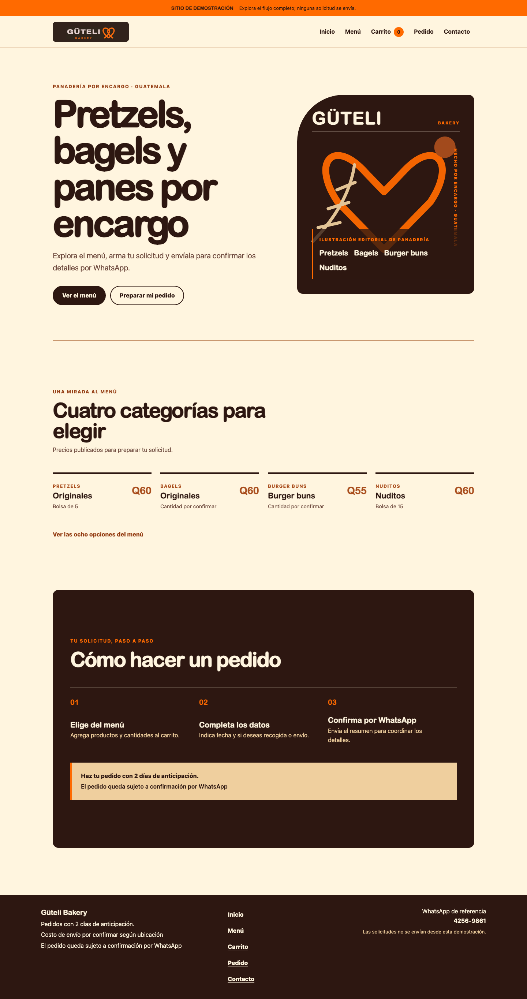
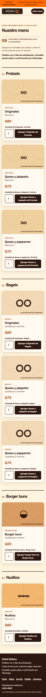
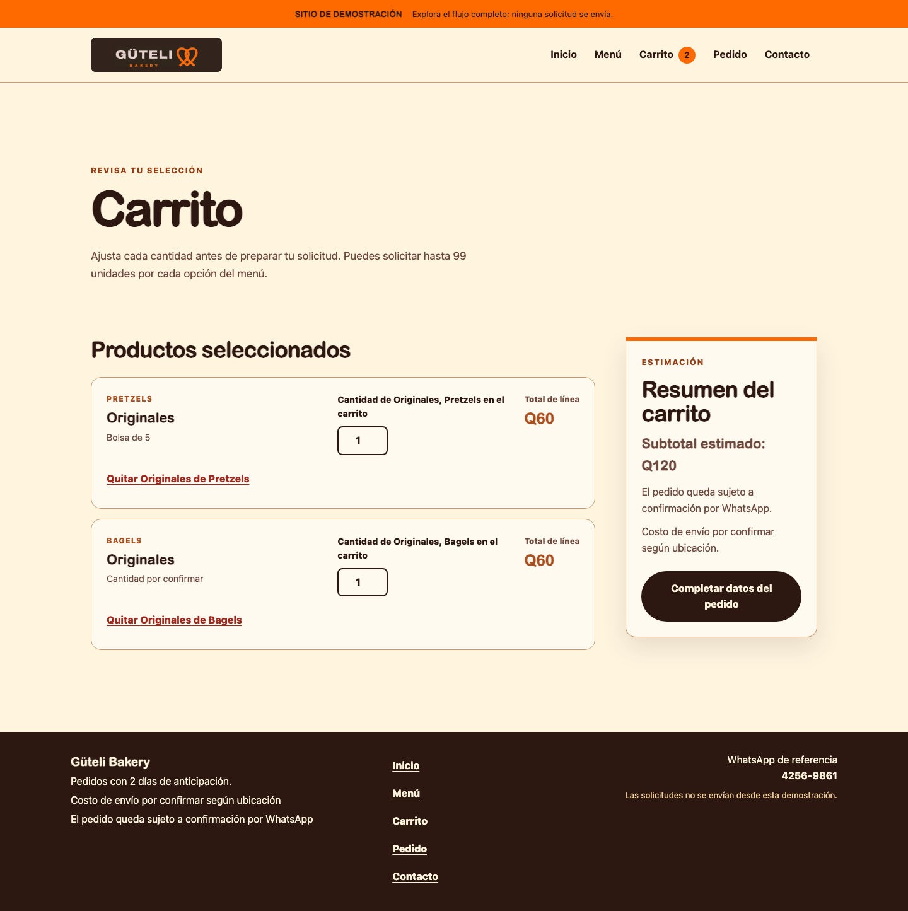
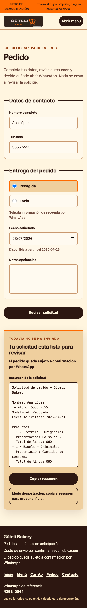
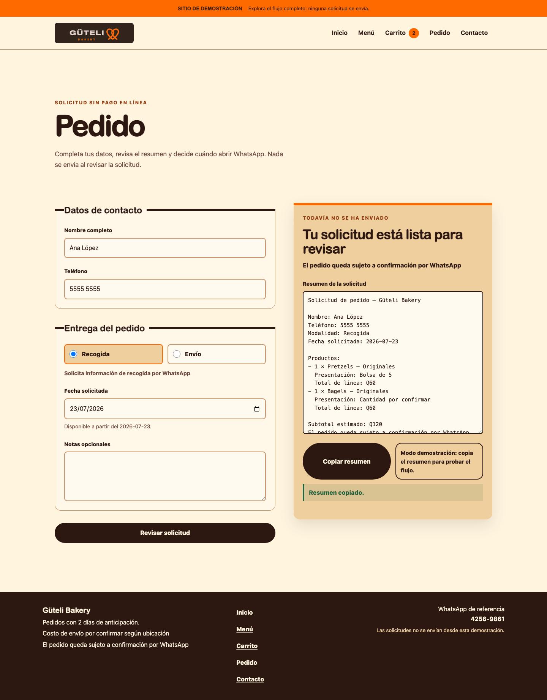

# Güteli Bakery — Frontend Order-Request Experience

## Problem

Güteli Bakery had confirmed products, prices, ordering caveats, a logo, and a WhatsApp contact number, but no polished digital journey for turning menu interest into a structured order request. The portfolio challenge was to demonstrate a complete customer workflow without inventing business facts, presenting unverified photography, or pretending that a backend order system existed.

## Solution

The project is a Spanish-first, mobile-first storefront and order-request experience. Customers can browse the confirmed menu, select quantities, review a cart estimate, enter fulfillment details, validate the minimum request date, generate a readable summary, and copy that summary for coordination.

The visual system uses Güteli's confirmed name and wordmark with original editorial typography, flat brand color, abstract pretzel-inspired line work, packaging-style labels, and clearly identified category illustrations. It does not reuse the flyer’s product photographs or imply that the artwork depicts Güteli's actual products.

## Customer journey

1. Discover the bakery's confirmed offer on the homepage.
2. Compare eight menu variants across four categories.
3. Add products and quantities to a browser-local cart.
4. Review line totals and the estimated GTQ subtotal.
5. Choose pickup or delivery and enter the required request details.
6. Review a generated Spanish summary.
7. Copy the summary or, when explicitly configured outside demo mode, open a user-controlled WhatsApp handoff.

No step auto-sends, confirms, charges for, or stores an order.

## Implemented functionality

- Five statically exported customer routes: Home, Menu, Cart, Order, and Contact.
- Typed source of truth for all eight confirmed products, prices, and known sale units.
- Versioned local cart persistence containing product IDs and quantities only.
- Add, update, remove, quantity-cap, line-total, and subtotal behavior.
- Pickup and delivery form states with field-specific validation.
- Guatemala-local two-calendar-day minimum request date.
- Readable Spanish order summary and clipboard success/fallback behavior.
- Persistent portfolio demo identification and fail-closed WhatsApp configuration.
- Empty cart, form validation, selected option, copy feedback, and unavailable-handoff states.
- Keyboard-operable navigation and form flow, visible focus, touch-target checks, reduced-motion support, console checks, and horizontal-overflow coverage.

## Mobile-first and accessibility decisions

The experience starts with stacked content and full-width controls at 390px, then introduces two-column cards and split form/summary layouts only when the content has enough room. Additional checks cover 320px, 768px, 1024px, and 1440px widths.

Semantic landmarks, a skip link, explicit form labels, required-state markup, focused error summaries, linked error recovery, visible selection state, readable contrast, and minimum touch targets support keyboard and mobile use. Decorative bakery vectors are hidden from assistive technology, while category artwork is explicitly labeled as illustration rather than product photography. Non-essential animation is disabled under reduced-motion preferences.

## Technical approach

- Next.js 16 static export with React 19 and TypeScript 5.9.
- Pure TypeScript modules for cart behavior, date rules, order validation, summary creation, WhatsApp URL encoding, and public demo configuration.
- React context for cart state; personal order fields remain in component memory and are never persisted.
- Plain CSS design tokens and responsive layouts with no remote font or runtime asset dependency.
- Vitest for deterministic domain/configuration behavior and Playwright Chromium for the complete customer journey, accessibility contracts, responsive states, and real screenshot capture.

The product-card media region is isolated in `ProductArtwork`. Verified high-resolution photographs can replace that inner presentation in the future without changing menu hierarchy, purchasing controls, or responsive card layout.

## Demo-safe WhatsApp handoff

Portfolio builds fail safely into demo mode. A persistent banner explains that no request is sent, the complete summary and copy flow remain usable, and no active `wa.me` link is rendered in the order page, contact page, or footer.

Live handoff requires both the exact public setting `NEXT_PUBLIC_DEMO_MODE=false` and a valid digits-only `NEXT_PUBLIC_WHATSAPP_DESTINATION`. The displayed business number is separate from the configured send destination and is never silently reused. Missing or malformed live configuration shows an unavailable state and preserves manual copy.

## Selected screenshots

### Desktop homepage

### Mobile menu

### Filled desktop cart

### Mobile order summary

### Demo-safe handoff and copy success

## Future integration path

The static frontend is ready to connect to a separately designed order backend, verified authentic product photography, inventory rules, payment instructions, analytics, or an approved WhatsApp Business integration. Each would require new business confirmation, privacy review, security design, and explicit authorization rather than being implied by this demonstration.

## Current limitations

- No backend, database, order notification, inventory, payment, or customer account exists.
- No authentic product photography has been approved for use.
- Pickup address, hours, delivery zones, payment methods, and some sale-unit details remain unconfirmed.
- The public portfolio demo intentionally cannot open a real WhatsApp destination.
- The project has not been publicly deployed.
